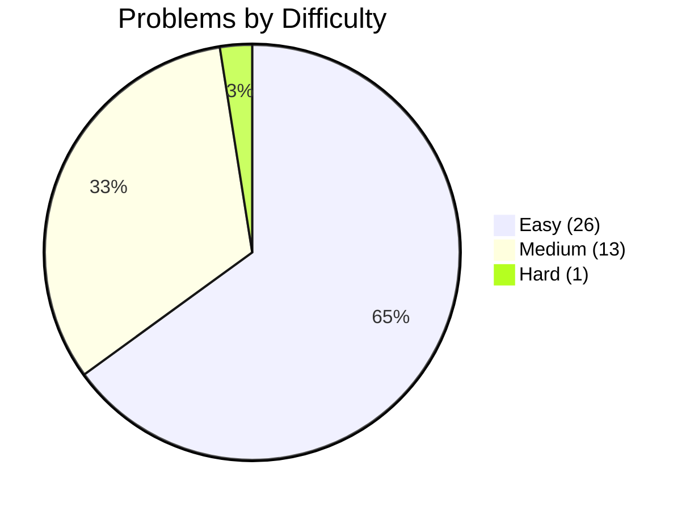
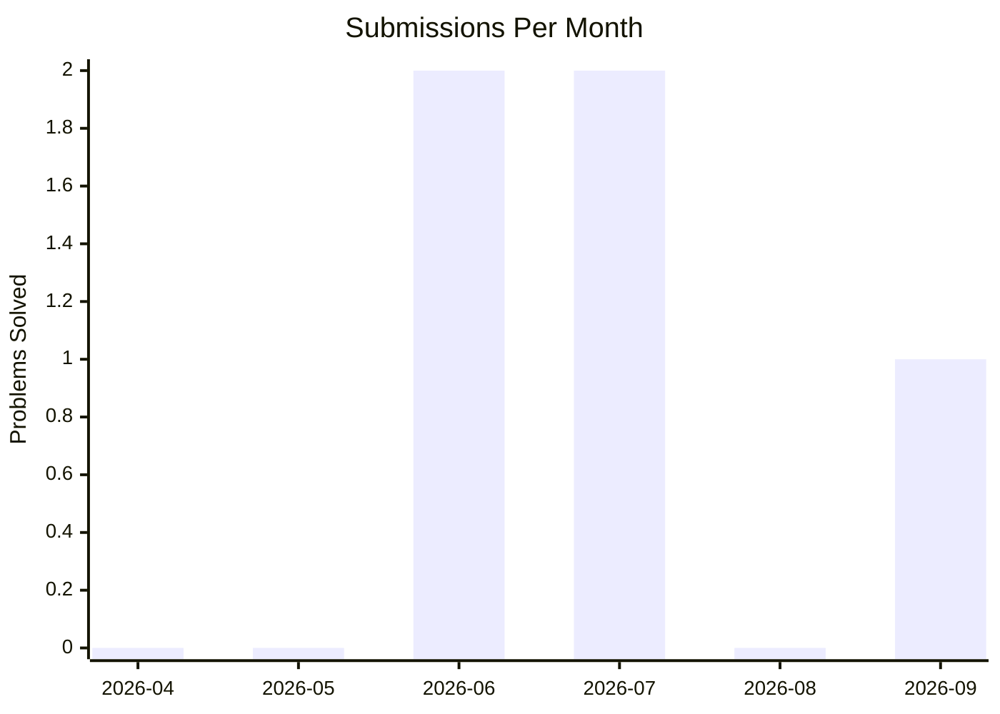
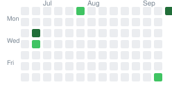

# LeetCode Progress

    

### Current Month Activity
| Sun | Mon | Tue | Wed | Thu | Fri | Sat |
| --- | --- | --- | --- | --- | --- | --- |
| - | - | ❌ | ❌ | ❌ | ❌ | ❌ |
| ❌ | ❌ | ❌ | ❌ | ❌ | ❌ | ❌ |
| ❌ | ❌ | ❌ | ❌ | ❌ | ❌ | ✅ |
|   |   |   |   |   |   |   |
|   |   |   |   | - | - | - |

### Activity Heatmap (Last 3 Months)

### Missed Days
| Date | Day |
| --- | --- |
| 2026-09-09 | Wednesday |
| 2026-09-10 | Thursday |
| 2026-09-11 | Friday |
| 2026-09-12 | Saturday |
| 2026-09-13 | Sunday |
| 2026-09-14 | Monday |
| 2026-09-15 | Tuesday |
| 2026-09-16 | Wednesday |
| 2026-09-17 | Thursday |
| 2026-09-18 | Friday |
| ... | ... (497 total missed days) |

### Milestones
- [x] First problem solved
- [ ] 5-day streak
- [x] 10 problems solved
- [x] 25 problems solved
- [ ] 50 problems solved
- [ ] 100 problems solved
- [ ] 200 problems solved
- [ ] 30-day streak

### Difficulty Distribution
Easy:   █████████████
Medium: ██████
Hard:   █

