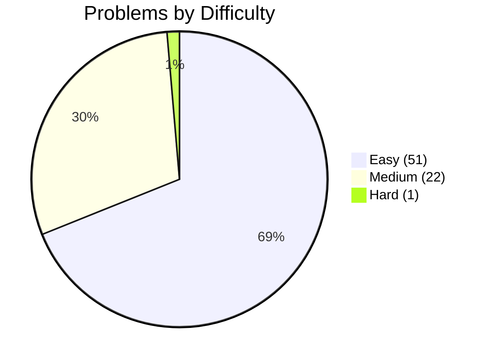
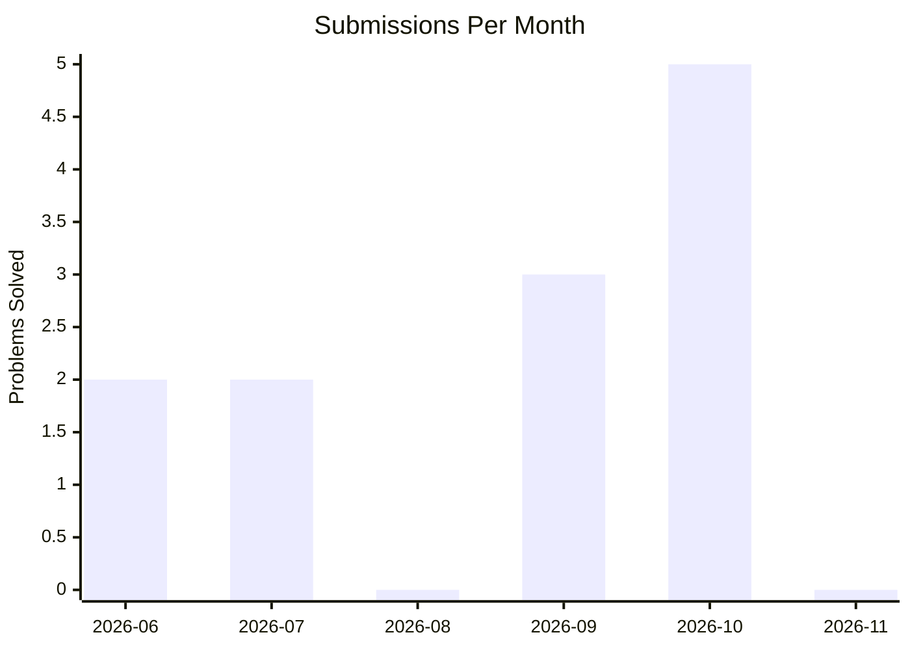
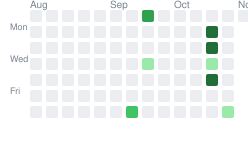

# LeetCode Progress

    

```mermaid
pie title Problems by Difficulty
    "Easy (51)" : 51
    "Medium (22)" : 22
    "Hard (1)" : 1
```

```mermaid
xychart-beta
    title "Submissions Per Month"
    x-axis ["2026-06", "2026-07", "2026-08", "2026-09", "2026-10", "2026-11"]
    y-axis "Problems Solved" 0 --> 5
    bar [2, 2, 0, 3, 5, 0]
```

### Current Month Activity
| Sun | Mon | Tue | Wed | Thu | Fri | Sat |
| --- | --- | --- | --- | --- | --- | --- |
| ❌ |   |   |   |   |   |   |
|   |   |   |   |   |   |   |
|   |   |   |   |   |   |   |
|   |   |   |   |   |   |   |
|   |   | - | - | - | - | - |

### Activity Heatmap (Last 3 Months)

### Missed Days
| Date | Day |
| --- | --- |
| 2026-10-18 | Sunday |
| 2026-10-23 | Friday |
| 2026-10-24 | Saturday |
| 2026-10-25 | Sunday |
| 2026-10-26 | Monday |
| 2026-10-27 | Tuesday |
| 2026-10-28 | Wednesday |
| 2026-10-29 | Thursday |
| 2026-10-30 | Friday |
| 2026-11-01 | Sunday |
| ... | ... (533 total missed days) |

### Milestones
- [x] First problem solved
- [ ] 5-day streak
- [x] 10 problems solved
- [x] 25 problems solved
- [x] 50 problems solved
- [ ] 100 problems solved
- [ ] 200 problems solved
- [ ] 30-day streak

### Difficulty Distribution
Easy:   █████████████
Medium: █████
Hard:   ██

